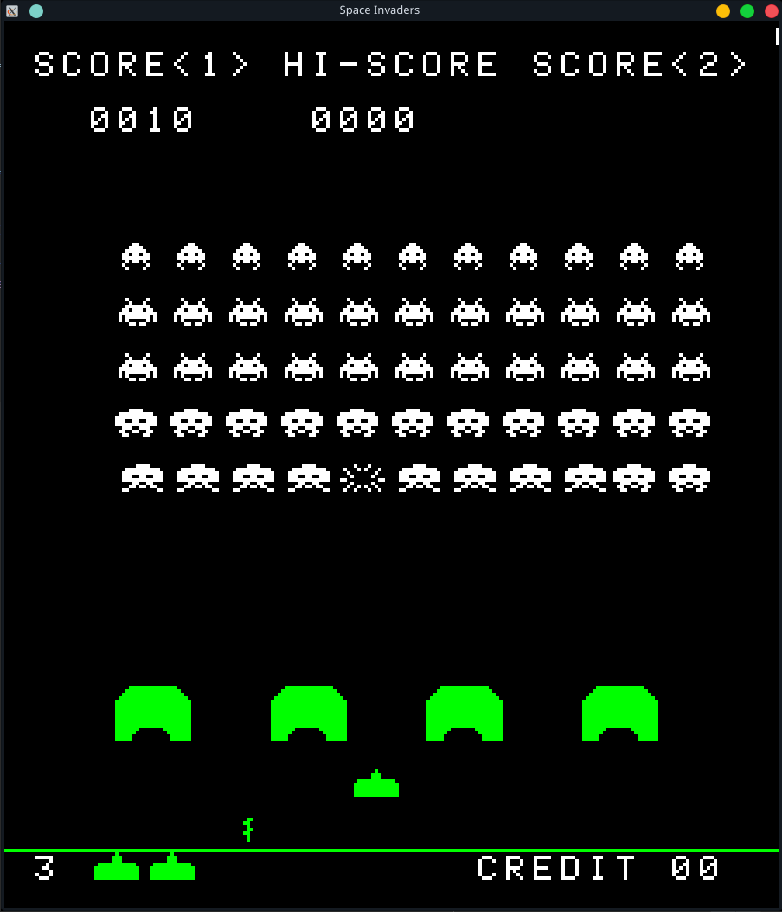
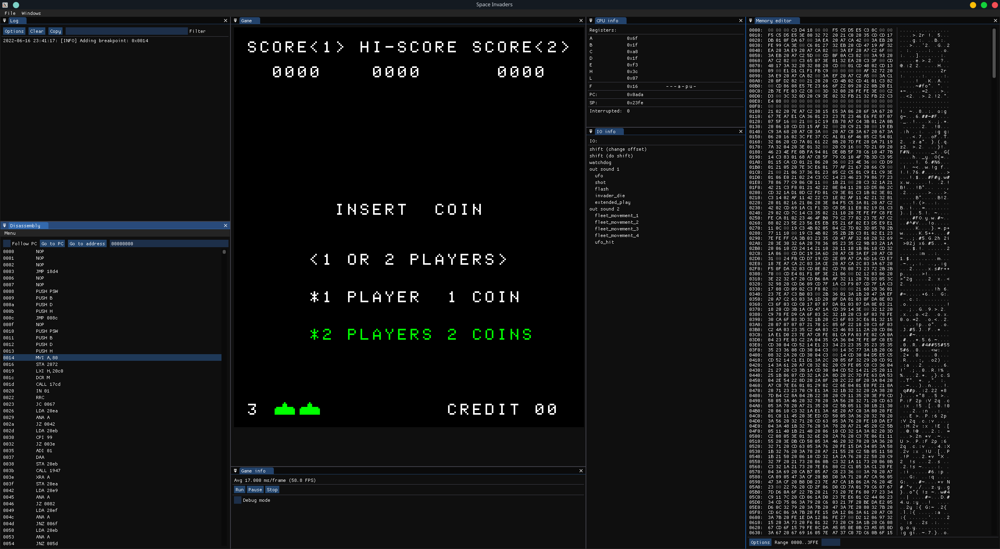

# Emulators

This is my collection of emulators, written in C++. As of now, it only emulates Intel 8080, with the game Space
Invaders. A Z80 emulator is currently being worked on.

The project is licensed under [The MIT License](LICENSE.md), with the test roms and libraries as exceptions. They have
their own licenses. See the source code of each test rom or in the library folders to see their license or copyright
notice.

## Table of contents

* [Dependencies](#dependencies)
* [Building](#building)
* [Emulated CPUs](#emulated-cpus)
    * [Intel 8080](#intel-8080)
        * [Space Invaders](#space-invaders)
        * [Inspiration](#inspiration)
        * [Todo](#todo)
    * [Z80](#z80)
        * [Pacman](#pacman)
        * [Inspiration](#inspiration-1)
        * [Todo](#todo-1)

## Dependencies

- [SDL2](https://www.libsdl.org/) (and SDL2_image)
- [Dear Imgui](https://github.com/ocornut/imgui) (included)
- [OpenGL](https://www.opengl.org/)
- [cmake](https://cmake.org/) 3.17 or later
- [doctest](https://github.com/doctest/doctest) (included)
- [fmt](https://fmt.dev/)

## Building

CMake, fmt, OpenGL and SDL2 have to be installed before building.

```sh
mkdir cmake-build-debug
cmake -G "CodeBlocks - Unix Makefiles" -B cmake-build-debug/
cmake --build cmake-build-debug/
```

## Emulated CPUs

### Intel 8080

Passes the following test binaries:

- `CPUTEST.COM`:

```
DIAGNOSTICS II V1.2 - CPU TEST
COPYRIGHT (C) 1981 - SUPERSOFT ASSOCIATES

ABCDEFGHIJKLMNOPQRSTUVWXYZ
CPU IS 8080/8085
BEGIN TIMING TEST
END TIMING TEST
CPU TESTS OK
```

- `TST8080.COM`:

```
MICROCOSM ASSOCIATES 8080/8085 CPU DIAGNOSTIC
 VERSION 1.0  (C) 1980

 CPU IS OPERATIONAL
```

- `8080PRE.COM`:

```
8080 Preliminary tests complete
```

- `8080EXM.COM`:

```
8080 instruction exerciser
dad <b,d,h,sp>................  PASS! crc is:14474ba6
aluop nn......................  PASS! crc is:9e922f9e
aluop <b,c,d,e,h,l,m,a>.......  PASS! crc is:cf762c86
<daa,cma,stc,cmc>.............  PASS! crc is:bb3f030c
<inr,dcr> a...................  PASS! crc is:adb6460e
<inr,dcr> b...................  PASS! crc is:83ed1345
<inx,dcx> b...................  PASS! crc is:f79287cd
<inr,dcr> c...................  PASS! crc is:e5f6721b
<inr,dcr> d...................  PASS! crc is:15b5579a
<inx,dcx> d...................  PASS! crc is:7f4e2501
<inr,dcr> e...................  PASS! crc is:cf2ab396
<inr,dcr> h...................  PASS! crc is:12b2952c
<inx,dcx> h...................  PASS! crc is:9f2b23c0
<inr,dcr> l...................  PASS! crc is:ff57d356
<inr,dcr> m...................  PASS! crc is:92e963bd
<inx,dcx> sp..................  PASS! crc is:d5702fab
lhld nnnn.....................  PASS! crc is:a9c3d5cb    
shld nnnn.....................  PASS! crc is:e8864f26
lxi <b,d,h,sp>,nnnn...........  PASS! crc is:fcf46e12
ldax <b,d>....................  PASS! crc is:2b821d5f
mvi <b,c,d,e,h,l,m,a>,nn......  PASS! crc is:eaa72044
mov <bcdehla>,<bcdehla>.......  PASS! crc is:10b58cee
sta nnnn / lda nnnn...........  PASS! crc is:ed57af72
<rlc,rrc,ral,rar>.............  PASS! crc is:e0d89235
stax <b,d>....................  PASS! crc is:2b0471e9
Tests complete
```

The CP/M test binaries can be run like this:

```sh
cd cmake-build-debug/
./emulator 8080 run CPUTEST
./emulator 8080 run TST8080
./emulator 8080 run 8080PRE
./emulator 8080 run 8080EXM
```

Unlike Space Invaders, the test binaries are provided.

#### Space Invaders

The emulator can also play Space Invaders. The rom files are not provided. To run Space Invaders, run the following
after building:

```sh
cd cmake-build-debug/
./emulator 8080 run space_invaders
```

The four rom files (invaders.e, invaders.f, invaders.g and invaders.h) have to be in the same directory as the emulator
binary.

It is possible to provide arguments that sets the DIP switches. The flag is `-d`, and it has the following options:

- `n=3`, `n=4`, `n=5` or `n=6` sets number of lives. The default value, if unset, is 3 lives.
- `b=1000` or `b=1500` sets bonus life at a score of 1000 or 1500. The default value, if unset, is bonus live at 1500.
- `c=on` or `c=off` sets coin on or off. Doesn't seem to do anything.

An example:

```sh
./emulator 8080 run space_invaders -d n=5 -d b=1500
```

sets number of lives to 5 and bonus life at a score of 1500.

It is also possible to switch between the ordinary GUI (plain SDL) and the debugging GUI (based on Dear Imgui), using
the `-g` flag:

- `ordinary` starts the ordinary GUI. The default value, if unset.
- `debugging` starts the debugging GUI.

An example:

```sh
./emulator 8080 run space_invaders -g debugging
```

The keymap is:

<table>
<tr>
<th>Gameplay</th><th>Debugging</th>
</tr>
<tr>
<td>

| Key                | Description   |
|--------------------|---------------|
| <kbd>C</kbd>       | Insert coin   |
| <kbd>T</kbd>       | Tilt          |
| <kbd>Enter</kbd>   | P1 start      |
| <kbd>A</kbd>       | P1 left       |
| <kbd>D</kbd>       | P1 right      |
| <kbd>W</kbd>       | P1 shoot      |
| <kbd>R Shift</kbd> | P2 start      |
| <kbd>←</kbd>       | P2 left       |
| <kbd>→</kbd>       | P2 right      |
| <kbd>↑</kbd>       | P2 shoot      |
| <kbd>Pause</kbd>   | Pause/unpause |
| <kbd>M</kbd>       | Mute/unmute   |

</td>
<td>

| Key           | Description        |
|---------------|--------------------|
| <kbd>F7</kbd> | Step instruction   |
| <kbd>F8</kbd> | Step cycle         |
| <kbd>F9</kbd> | Continue execution |

</td>
</tr>
</table>

Screenshots:

|                                                                           |                                                                                                    |
|:-------------------------------------------------------------------------:|:--------------------------------------------------------------------------------------------------:|
|  |  | 
|                          *Plain Space Invaders*                           |                                *Space Invaders in the debugger GUI*                                |

#### Inspiration

I looked at the following emulators while developing my 8080 emulator:

- [herrecito's Space Invaders / Intel 8080 emulator](https://github.com/herrecito/invaders): Mainly for the timing loop.
- [Superzazu's Space Invaders emulator](https://github.com/superzazu/invaders): Mainly the drawing to screen.
- [Dromaius, a C++ gameboy emulator / debugger](https://github.com/ThomasRinsma/dromaius): Dear Imgui implementation.

The [Computer Archeology](http://computerarcheology.com/Arcade/SpaceInvaders/) page on Space Invaders was also used to
look up how the game is supposed to behave.

#### Todo

- [ ] Better argument handling
- [ ] Refactor to "sessions" for Space Invaders and the 8080 cpu
- [ ] Memory watcher for the debugger
- [ ] Start in stopped state when running with the debugger
- [ ] Disassembler syntax highlighting
- [ ] Conditional breakpoints
- [ ] Stack view (as in IDA Pro)

### Z80

This CPU is currently being worked on.

Passes the following test binaries:

- `prelim.com`:

```
Preliminary tests complete
```

- `zexall.cim`:

```
Z80all instruction exerciser
<adc,sbc> hl,<bc,de,hl,sp>....  OK
add hl,<bc,de,hl,sp>..........  OK
add ix,<bc,de,ix,sp>..........  OK
add iy,<bc,de,iy,sp>..........  OK
aluop a,nn....................  OK
aluop a,<b,c,d,e,h,l,(hl),a>..  OK
aluop a,<ixh,ixl,iyh,iyl>.....  OK
aluop a,(<ix,iy>+1)...........  OK
bit n,(<ix,iy>+1).............  OK
bit n,<b,c,d,e,h,l,(hl),a>....  OK
cpd<r>........................  OK
cpi<r>........................  OK
<daa,cpl,scf,ccf>.............  OK
<inc,dec> a...................  OK
<inc,dec> b...................  OK
<inc,dec> bc..................  OK
<inc,dec> c...................  OK
<inc,dec> d...................  OK
<inc,dec> de..................  OK
<inc,dec> e...................  OK
<inc,dec> h...................  OK
<inc,dec> hl..................  OK
<inc,dec> ix..................  OK
<inc,dec> iy..................  OK
<inc,dec> l...................  OK
<inc,dec> (hl)................  OK
<inc,dec> sp..................  OK
<inc,dec> (<ix,iy>+1).........  OK
<inc,dec> ixh.................  OK
<inc,dec> ixl.................  OK
<inc,dec> iyh.................  OK
<inc,dec> iyl.................  OK
ld <bc,de>,(nnnn).............  OK
ld hl,(nnnn)..................  OK
ld sp,(nnnn)..................  OK
ld <ix,iy>,(nnnn).............  OK
ld (nnnn),<bc,de>.............  OK
ld (nnnn),hl..................  OK
ld (nnnn),sp..................  OK
ld (nnnn),<ix,iy>.............  OK
ld <bc,de,hl,sp>,nnnn.........  OK
ld <ix,iy>,nnnn...............  OK
ld a,<(bc),(de)>..............  OK
ld <b,c,d,e,h,l,(hl),a>,nn....  OK
ld (<ix,iy>+1),nn.............  OK
ld <b,c,d,e>,(<ix,iy>+1)......  OK
ld <h,l>,(<ix,iy>+1)..........  OK
ld a,(<ix,iy>+1)..............  OK
ld <ixh,ixl,iyh,iyl>,nn.......  OK
ld <bcdehla>,<bcdehla>........  OK
ld <bcdexya>,<bcdexya>........  OK
ld a,(nnnn) / ld (nnnn),a.....  OK
ldd<r> (1)....................  OK
ldd<r> (2)....................  OK
ldi<r> (1)....................  OK
ldi<r> (2)....................  OK
neg...........................  OK
<rrd,rld>.....................  OK
<rlca,rrca,rla,rra>...........  OK
shf/rot (<ix,iy>+1)...........  OK
shf/rot <b,c,d,e,h,l,(hl),a>..  OK
<set,res> n,<bcdehl(hl)a>.....  OK
<set,res> n,(<ix,iy>+1).......  OK
ld (<ix,iy>+1),<b,c,d,e>......  OK
ld (<ix,iy>+1),<h,l>..........  OK
ld (<ix,iy>+1),a..............  OK
ld (<bc,de>),a................  OK
Tests complete
```

The CP/M test binaries can be run like this:

```sh
cd cmake-build-debug/
./emulator Z80 run prelim
./emulator Z80 run zexdoc
./emulator Z80 run zexall
```

#### Pacman

#### Inspiration

I looked at the following emulators and resources while developing my Z80 emulator:

- [Superzazu's Z80 emulator](https://github.com/superzazu/z80): Used as a reference emulator while looking for errors.
- [Justin-Credible's Pacman emulator](https://github.com/Justin-Credible/pac-man-emulator): Used as a reference when
  getting the video emulation to work.
- [Opcode table](https://clrhome.org/table/)
- [The Undocumented Z80 Documented by Sean Young](docs/z80/z80-documented-v0.91.pdf):
  Describes the undocumented opcodes
- [MEMPTR, esoteric register of the ZiLOG Z80 CPU](docs/z80/z80.memptr.eng.txt): Describes the behavior of the
  undocumented MEMPTR register.

#### Todo
