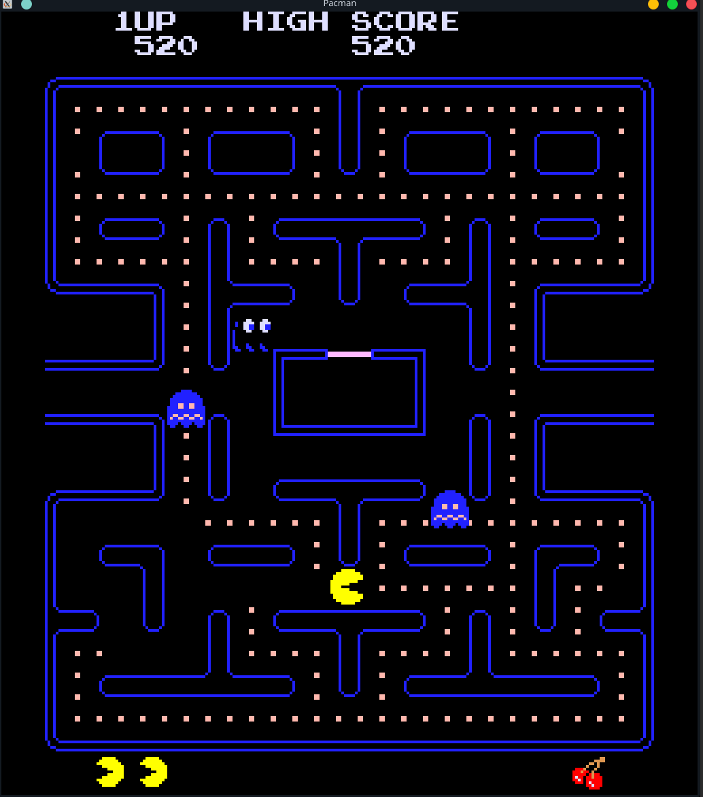
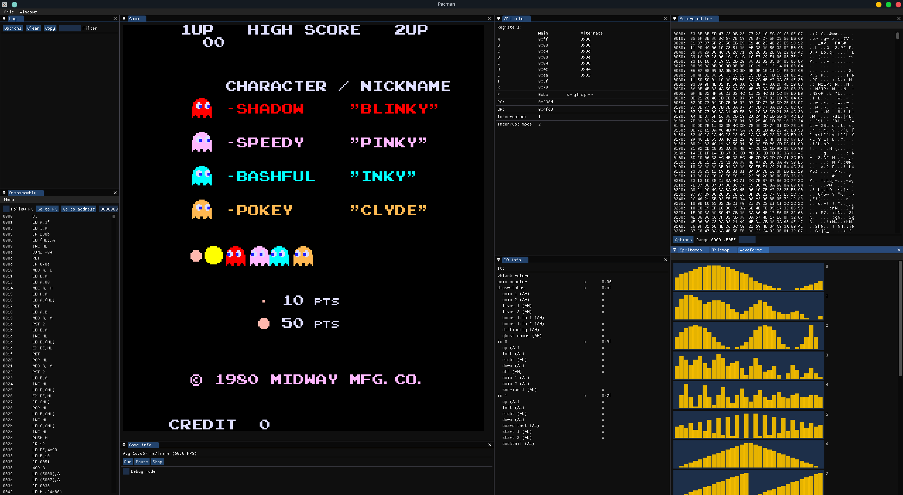

# Pacman

The rom files are not provided. To run Pacman:

```sh
./emulator run pacman
```

The ten rom files (82s123.7f, 82s126.1m, 82s126.3m, 82s126.4a, pacman.5e, pacman.5f, pacman.6e, pacman.6f, pacman.6h
and pacman.6j) have to be in the directory `roms/z80/pacman/`, using the emulator binary folder as root folder.

It is possible to provide arguments that sets the DIP switches, as well as the board test bit and cocktail mode bit.
The flag is `-d`, and it has the following options:

- `n=1`, `n=2`, `n=3` or `n=5` sets number of lives. The default value, if unset, is 3 lives.
- `b=10000`, `b=15000`, `b=20000` or `b=none` sets bonus life at a score of 10000, 15000, 20000 points, or disables
  bonus lives. The default value, if unset, is bonus life at 15000.
- `c=1C1G`, `c=1C2G`, `c=2C1G` or `c=free` sets the price of each game: either one-per-game, one-per-two-games,
  two-per-game or free. The default value, if unset, is one per game.
- `d=normal` or `d=hard` sets the difficulty. The default value, if unset, is normal.
- `g=normal` or `g=alternate` sets the ghost names. The default value, if unset, is normal.
- `t=on` or `t=off` sets the board test bit. The default value, if unset, is off.
- `m=table` or `t=upright` sets the cabinet mode bit. The default value, if unset, is upright.

An example:

```sh
./emulator run pacman -d n=5 -d b=20000
```

sets number of lives to 5 and bonus life at a score of 20000.

It is also possible to switch between the ordinary GUI (plain SDL) and the debugging GUI (based on Dear Imgui), using
the `-g` flag:

- `ordinary` starts the ordinary GUI. The default value, if unset.
- `debugging` starts the debugging GUI.

An example:

```sh
./emulator run pacman -g debugging
```

The keymap is:

<table>
<tr>
<th>Gameplay</th><th>Debugging</th>
</tr>
<tr>
<td>

| Key                | Description    |
|--------------------|----------------|
| <kbd>C</kbd>       | Insert coin P1 |
| <kbd>V</kbd>       | Insert coin P2 |
| <kbd>Enter</kbd>   | P1 start       |
| <kbd>W</kbd>       | P1 up          |
| <kbd>A</kbd>       | P1 left        |
| <kbd>D</kbd>       | P1 right       |
| <kbd>S</kbd>       | P1 down        |
| <kbd>R Shift</kbd> | P2 start       |
| <kbd>↑</kbd>       | P2 up          |
| <kbd>←</kbd>       | P2 left        |
| <kbd>→</kbd>       | P2 right       |
| <kbd>↓</kbd>       | P2 down        |
| <kbd>Pause</kbd>   | Pause/unpause  |
| <kbd>M</kbd>       | Mute/unmute    |

</td>
<td>

| Key                  | Description         |
|----------------------|---------------------|
| <kbd>F7</kbd>        | Step instruction    |
| <kbd>F8</kbd>        | Step cycle          |
| <kbd>F9</kbd>        | Continue execution  |
| <kbd>PAGE UP</kbd>   | Toggle tile debug   |
| <kbd>PAGE DOWN</kbd> | Toggle sprite debug |

</td>
</tr>
</table>

The P2 controls are only used in cocktail mode. In upright mode P2 uses the same keys as P1.

**Screenshots:**

|                                                                |                                                                                         |
|:--------------------------------------------------------------:|:---------------------------------------------------------------------------------------:|
|  |  | 
|                         *Plain Pacman*                         |                              *Pacman in the debugger GUI*                               |
