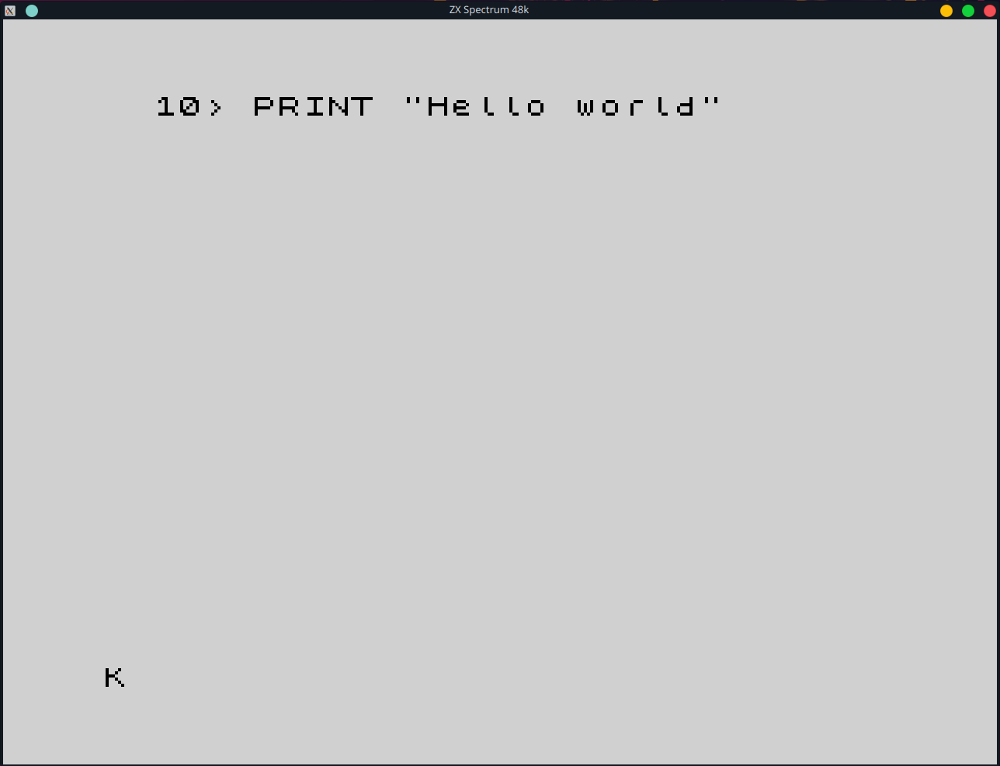
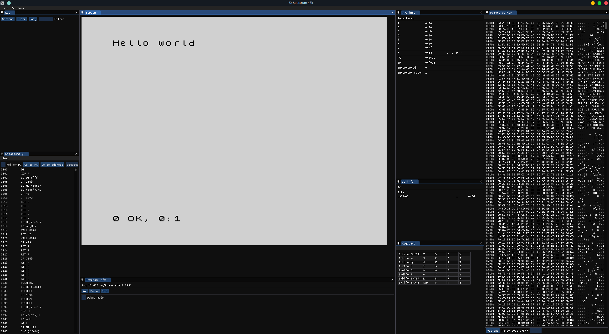

# ZX Spectrum 48K

The emulator adapts itself to keyboard of the host machine. E.g. if you have an azerty keyboard and press 'a', you will
get 'a' and not 'q'. The following keys are mapped to the ordinary keys on a modern keyboard:

- <kbd>Backspace</kbd>
- <kbd>Return</kbd>
- <kbd>Caps lock</kbd>
- <kbd>←</kbd>, <kbd>→</kbd>, <kbd>↑</kbd>, <kbd>↓</kbd>
- <kbd>!</kbd>, <kbd>"</kbd>, <kbd>#</kbd>, <kbd>@</kbd>, <kbd>%</kbd>, <kbd>&</kbd>, <kbd>/</kbd>, <kbd>|</kbd>, <kbd>_</kbd>, <kbd>(</kbd>, <kbd>)</kbd>, <kbd>[</kbd>, <kbd>]</kbd>, <kbd>{</kbd>, <kbd>}</kbd>, <kbd>?</kbd>, <kbd>'</kbd>, <kbd>~</kbd>, <kbd>^</kbd> (↑)
- <kbd>+</kbd>, <kbd>-</kbd>, <kbd>/</kbd>, <kbd>*</kbd>, <kbd><</kbd>, <kbd>></kbd>, <kbd>=</kbd>
- <kbd>.</kbd>, <kbd>,</kbd>, <kbd>:</kbd>, <kbd>;</kbd>

Caps shift is mapped to <kbd>Left shift</kbd> and symbol shift to <kbd>Left alt</kbd>.

The edit command is mapped to <kbd>F1</kbd>, caps lock to <kbd>F2</kbd> (and to the <kbd>Caps lock</kbd> key as well),
true video to <kbd>F3</kbd>, inverted video to <kbd>F4</kbd>, and finally graphics mode to <kbd>F9</kbd>.

<kbd>Pause</kbd> can be used to toggle pause.

The keymap for debugging:

<table>
<tr>
<th>Debugging</th>
</tr>
<tr>
<td>

| Key                  | Description         |
|----------------------|---------------------|
| <kbd>F7</kbd>        | Step instruction    |
| <kbd>F8</kbd>        | Step cycle          |
| <kbd>F9</kbd>        | Continue execution  |

</td>
</tr>
</table>

**Screenshots:**

|                                                                                               |                                                                                                                       |
|:---------------------------------------------------------------------------------------------:|:---------------------------------------------------------------------------------------------------------------------:|
|  |  | 
|                                    *Plain ZX Spectrum 48K*                                    |                                         *ZX Spectrum 48K in the debugger GUI*                                         |

## Inspiration

- [L Break Intro Program on the ZX Spectrum](http://www.breakintoprogram.co.uk/hardware/computers/zx-spectrum)
- [no$ - Sinclair ZX Specifications](https://problemkaputt.de/zxdocs.htm#zxspectrum)
- [comp.sys.sinclair FAQ](http://fizyka.umk.pl/~jacek/zx/faq/reference/48kreference.htm)
