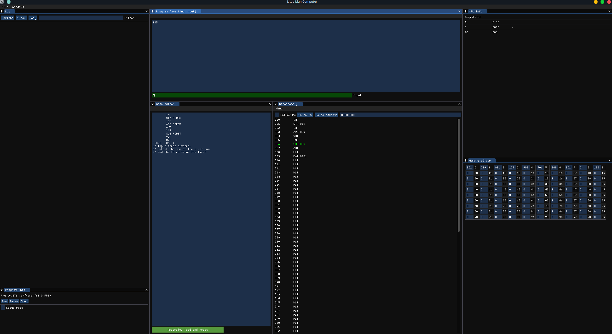

# Little Man Computer (LMC)

[LMC](https://en.wikipedia.org/wiki/Little_man_computer) is a very simple, fake architecture, used to teach students
CS concepts.

This implementation reads assembly directly and assembles it to machine code.

It supports all opcodes, including the `OTC` opcode that prints ASCII to the terminal.

To run LMC in the terminal:

```sh
./emulator run lmc_application <filename>
```

To run with the debugger GUI:

```sh
./emulator run lmc_application -g debugging <filename>
```

The keymap in the debugger is:

<table>
<tr>
<th>Debugging</th>
</tr>
<tr>
<td>

| Key                  | Description         |
|----------------------|---------------------|
| <kbd>F7</kbd>        | Step instruction    |
| <kbd>F9</kbd>        | Continue execution  |

</td>
</tr>
</table>

**Screenshot:**

|                                                                                |
|:------------------------------------------------------------------------------:|
|  | 
|                           *LMC in the debugger GUI*                            |
